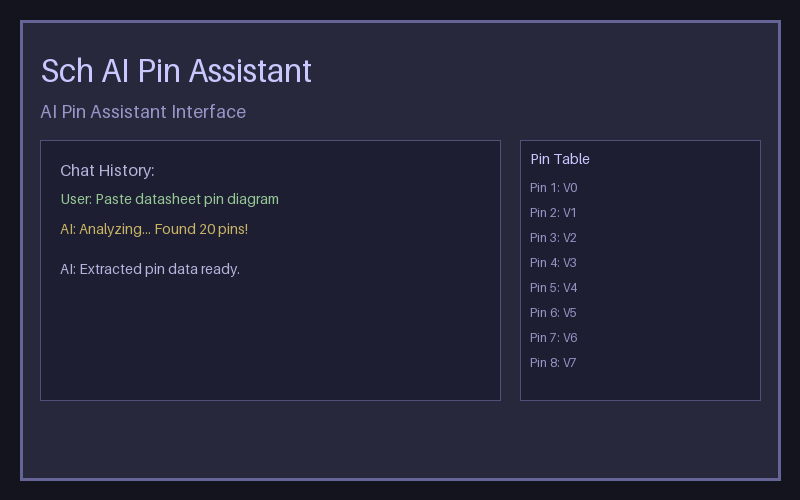

# Sch AI Pin Assistant

KiCad 10+ 插件：AI 驱动的符号引脚助手，从芯片数据手册引脚图自动生成 KiCad 原理图符号。



## 功能

- 📷 粘贴或拖入芯片引脚图，AI 自动识别引脚信息
- 💬 对话式交互，可随时询问 AI 修改或补充引脚
- 📋 一键复制到符号编辑器，或保存为 `.kicad_sym` 文件
- 🌐 支持多模型：agnes、minimax、glm、kimi 等，支持自定义端点
- 🌍 中英文自动切换
- 📊 导出引脚数据为 JSON

## 安装

### 方法一：KiCad 扩展内容管理器（推荐）

1. 从 [Releases](https://github.com/HaydenHu/kicad-sch-ai-assistant/releases) 下载 `sch-ai-assistant.zip`
2. **偏好设置 → 插件** → 勾选 **启用 KiCad API**
3. **扩展内容管理器 → 从文件安装** → 选择下载的 zip 文件
4. 点击 **应用挂起的更改**
5. 重启 KiCad
6. 在原理图编辑器或符号编辑器中，点击菜单 **文件 → 插件 → AI Pin Assistant**

## 使用步骤

1. 打开 KiCad 原理图编辑器
2. 点击 **AI Pin Assistant** 图标打开插件窗口
3. 在 **设置** 中配置 API Key（免费获取：<https://platform.agnes-ai.com/settings/apiKeys>）
4. 选择模型和接入点（也可手动输入自定义模型名和端点）
5. 复制芯片数据手册的引脚图，在插件窗口按 **Ctrl+V** 粘贴，或点击 **文件** 按钮拖入
6. 点击 **识别符号** 开始分析
7. 在右侧表格中查看并编辑引脚信息
8. 点击 **复制到符号编辑器** 或 **保存 .kicad_sym** 导出符号

## 配置

### 支持的模型

| 模型 | 接入点 |
|------|--------|
| agnes-2.5-flash | api.agnes-ai.cn |
| agnes-2.5-pro | api.agnes-ai.cn |
| minimax-m3 | api.minimax.chat |
| glm-5.3 | open.bigmodel.cn |
| kimi-k2.5 | api.moonshot.cn |

下拉框支持编辑，可输入任意模型名称和端点。

### API Key

插件设置中配置 API Key。免费 Key 获取地址：<https://platform.agnes-ai.com/settings/apiKeys>

## 依赖

```
kicad-python>=0.7.0
wxPython~=4.2
requests>=2.28
```

## 许可证

MIT
